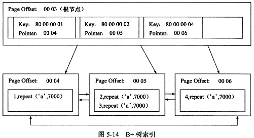

#5.4 B+树索引
## 5.4.1 聚集索引
#define PAGE_LEVEL                 28     /*当前页在索引树的层位置*/ 
page level:0000 数据页

page level:0001 数据页上一层的页~~

page 0003的page level 为0001；

page 0004、0005、0006的page level为0000（数据页）；

> 非叶子结点的key是其指向的数据页里最小的key，80000001即为主键为1的记录；
> Infimum记录的结构：
> 前5个字节为recorder header，后面为字符串infimum的ascii。
> Infimum的recorder header里next record指针指向当前页lowest key的记录；
> Supremum类似。
> Supremum的next record指针为0，而当前页拥有highest key用户记录的next record指针指向supremum
Infimum和Supremum之间的任何记录，指向其对应的数据页！！！

UserRecord的类型分为四种：
1. 主键索引非叶子结点页的record

> key:为所指向的数据页里主键的最小值；
> pointer:包含key的数据页；
> netx record:指向下一个record；
1. 主键索引叶子结点页的record
> 这个record就是包含真是的行数据；
> next record：以及指向下一个record
1. 辅助索引非叶子结点页的record
> ...
1. 辅助索引叶子结点页的record
> ...

#5.5 Cardinality

索引中唯一值(不重复记录)的数目的估计值。

ANALYSE TABLE 可以更新Cardinality的值，有助于优化器做出正确的选择，explain的时候。

一般情况下，访问表中很少一部分数据时，B+树索引才有意义。

Cardinality/n_rows_in_table ≈ 1，应该尽可能接近1。

InnoDB内部更新Cardinality的策略：
1. 表中1/16的数据已经发生变化
1. stat_modified_counter >= 20 0000 0000

Cardinality是随机选8个叶子结点page进行统计。

#5.6 B+树索引的使用

联合索引idx_a_b(a,b)，单独使用b查询不走索引，因为b在索引树上是无序的。

##5.6.3 覆盖索引
covering index

##5.6.5 索引提示
> MySQL 错误的使用了索引，导致效率低。
> 某SQL语句可用的索引非常多，优化器选择执行计划的时间开销大于SQL本身。

use index(a)

force index(a)
##5.6.6 Multi Range Read优化

将查询到的辅助索引键值放到一个缓存，这个缓存是根据辅助索引键值排序的。

将缓存中的键值根据主键排序。

根据主键排序后的键值去查询数据文件。

select * from t
    where key_part1 > 1000 and key_part1 < 2000
    and key_part2 = 1000;

不开启MRR:
查询类型为Range，优化器先把key_part1>1000且<2000的数据都取出，即使key_part2不等于1000
开启MRR:
优化器根据条件进行拆分，上面的查询可能被优化成：（1000， 1000）（10001,1000）（1002,1000）（1003,1000）...

##5.6.7 Index Condition Pushdown

根据索引查询的优化方式。

不支持的情况下：
首先根据索引取出记录，然后再根据where条件过滤；

支持ICP的情况：
在从索引取出记录的同时，判断是否可以进行where条件过滤，把where的部分过滤操作放到了存储引擎层面。
大大减少了上层的SQL层对下层引擎层的数据索取（fetch），从而提高性能。

explain--Using Index Conditioning

##5.7 哈希算法

