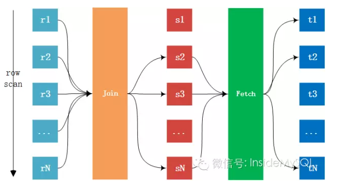
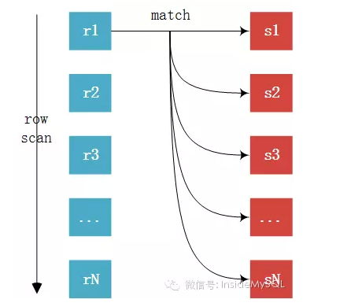
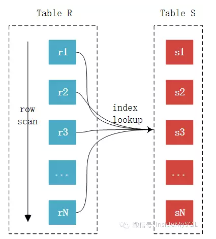
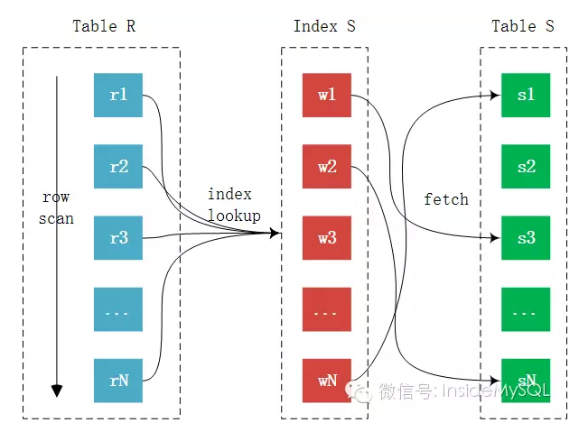
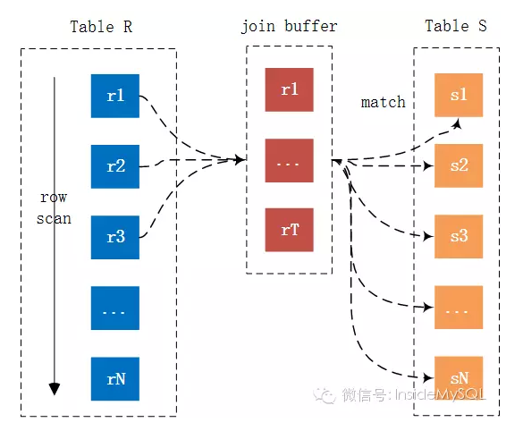
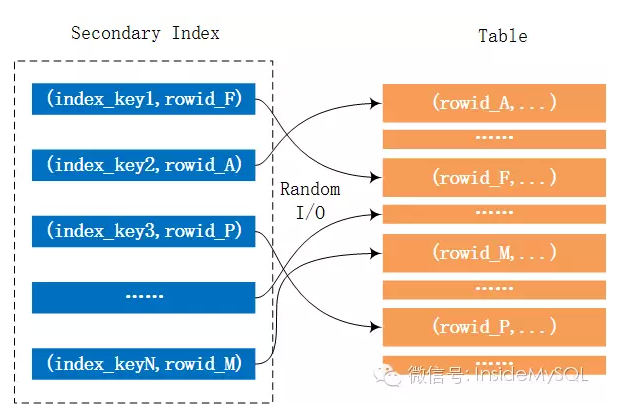
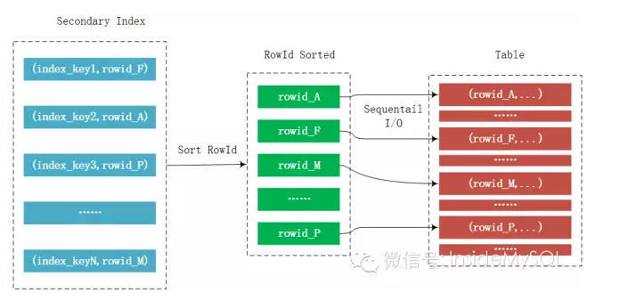
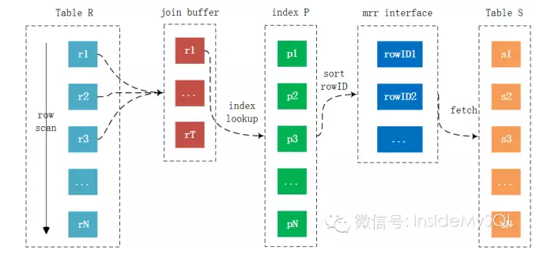

本文内容参考：

MySQL Join算法与调优白皮书（一）

MySQL Join算法与调优白皮书（二）

MySQL Join算法与调优白皮书（三）

MySQL Join算法与调优白皮书（四 ）

**Join算法的整体流程：** 
 

计算两张表Join的成本，这里有下列几种概念： 
**外表的扫描次数**，记为O。通常外表的扫描次数都是1，即Join时扫描一次驱动表的数据即可 
**内表的扫描次数**，记为I。根据不同Join算法，内表的扫描次数不同 
**读取表的记录数**，记为R。根据不同Join算法，读取记录的数量可能不同 
**Join的比较次数**，记为M。根据不同Join算法，比较次数不同 
**回表的读取记录的数**，记为F。若Join的是辅助索引，可能需要回表取得最终的数据 

#MySQL的join算法采用的是Nested Loop Join算法。 
顾名思义， Nested Loop Join 实际上就是通过驱动表的结果集作为循环的基础数据，然后一条一条的通过该结果集中的数据作为过滤条件到下一个表中查询数据，然后合并结果。如果还有第三个参与 Join，则再通过前两个表的 Join 结果集作为循环基础数据，再一次通过循环查询条件到第三个表中查询数据，如此往复。
在这种算法下又分为几种不同的算法： 

>##Simple Nested Loop Join

###示意图

###伪代码
    For each row r in R do
        Foreach row s in S do
            If r and s satisfy the join condition 
                Then output the tuple
           
###算法说明

>##Indexed Nested Loop Join

###示意图

###伪代码
    For each row r in R do 
        lookup r in S index 
        if found s == r
            Then output the tuple

###算法说明
index nested loop join慢有一部分原因是因为，如果被驱动表的索引不能包含所有需要查询的数据，则需要一次fetch

>##Blocked Nested Loop Join

###示意图

###伪代码
    For each tuple r in R do
        store used columns as p from R in join buffer
        For each tuple s in S do
            If p and s satisfy the join condition
                Then output the tuple
                
###算法说明
在有索引的情况下，MySQL会尝试去使用Index Nested-Loop Join算法，在有些情况下，可能Join的列就是没有索引，那么这时MySQL的选择绝对不会是最先介绍的Simple Nested-Loop Join算法，因为那个算法太粗暴，不忍直视。
Join Buffer用以缓存链接需要的列，然后以Join Buffer批量的形式和内表中的数据进行链接比较。就上图来看，记录r1，r2 … rT的链接仅需扫内表一次，如果join buffer可以缓存所有的外表列，那么链接仅需扫描内外表各一次，从而大幅提升Join的性能。
                
                
>##Bathed Key Access Join

###MRR
####no mrr

####mrr

###示意图

###伪代码
###算法说明

#Join算法优化

参考MySQL性能调优与架构设计.pdf

>尽可能减少Nested Loop循环的总次数。

有效办法比如：驱动表的的结果集尽可能小，即：永远使用小表驱动大表。

>优化Nested Loop的内层循环。

类似于在优化代码时候所做的事情。

>保证Join语句中被驱动表上的字段已经被索引。

可以说这是一种优化内存循环的办法

>无法保证Join语句中被驱动表的字段有索引，并且在内存资源充足的情况下，不要吝啬Join Buffer参数。

