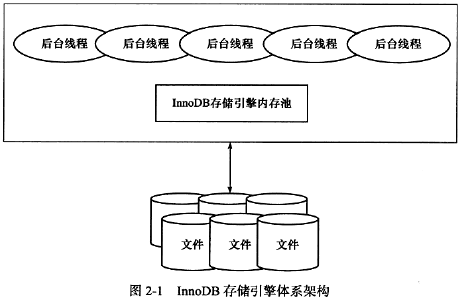
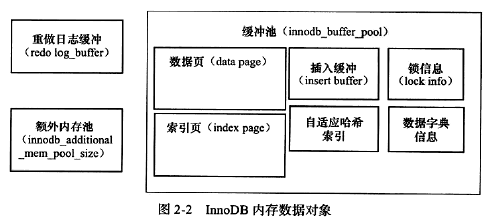

#2.3 InnoDB体系架构

##2.3.1 后台线程
###Master Thread
负责缓冲池中的数据异步刷新到磁盘，保证数据一致性，包括脏页的刷新、合并插入缓冲、UNDO页的回收等。
###IO Thread
write、read、insert buffer、log thread四种。
###Purge Thread
从Master线程中独立出来，用于合并已分配且使用的undo页。
###Page Clean Thread
从Master线程中独立出来，用于脏页的刷新。
##2.3.2 内存

###缓冲池
缓冲池中存储的数据页类型有：索引页、数据页、undo页、插入缓冲（insert buffer）、自适应哈希（adaptive hash index）、索信息、数据字典信息等。
###LRU、Free、Flush List
####LRU
在传统的LRU算法基础上，增加了midpoint位置，读取到的页，虽然是最新访问的页，但并不是直接放入到LRU的首部，而是放入LRU列表的midpoint位置。默认配置为5/8左右。
####Free
LRU用来管理已经读取的页，数据库刚启动时，LRU列表是空的，这时所有的页都在Free List。

当需要从缓冲池分配页时，首先从Free List查看是否有可用空闲页，若有则从Free List删除，然后加入到LRU List；否则，淘汰LRU末尾的页，并将该空间分配给新的页。
####Flush
在LRU List中的页被修改以后，就变成了脏页(dirty page)，即缓冲池中的页和磁盘上的页数据产生了不一致。这时数据库通过Checkpoint机制把脏页刷回磁盘，而Flush List中的页即为脏页列表。

脏页既存在于LRU List也存在与Flush List。

LRU List用来管理缓冲池中页的可用性，Flush List用来管理将页刷回磁盘，保证一致性，二者互不影响。
###重做日志缓冲
InnoDB引擎首先把重做日志信息放入到这个缓冲区，然后按照一定频率将其刷新到重做日志文件。

重做日志缓冲不需要设置的很大，因为一般情况下每1秒钟都会将重做日志缓冲刷新到日志文件。

重做日志缓冲在三种情况下回刷新到重做日志文件：
 >- Master Thread每一秒都将重做日志缓冲刷新到重做日志文件。 
 >- 个事务提交时会将...。 
 >- 重做日志缓冲剩余空间小于1/2时，...。
###额外内存池

#2.4 Checkpoint技术
缓冲池的目的是协调CPU速度与磁盘速度的鸿沟。因此，页的操作首先在缓冲池完成，一条DML语句改变了页中的记录，那么此时页是脏的，即：缓冲池中的页的版本比磁盘的要新。数据库需要将新版本的页从缓冲池刷新到磁盘。

WAL，Write Ahead Log策略，在事务提交时，先写事务日志，再修改页。满足事务的持久性（Durability）。

##Checkpoint技术解决的问题
###缩短数据库的恢复时间；
数据库发生宕机恢复时，不需要重做所有的日志，因为checkpoint点之前的页都已经刷回磁盘。只需要对checkpoint点之后的重做日志进行恢复。
###缓冲池不够用时，将脏页刷到磁盘；
缓冲池不够用时，根据LRU算法溢出最近最少使用的页，如果此页为脏页，则强制进行checkpoint，把脏页刷回磁盘。
###重做日志不可用时，刷新脏页；
重做日志是两个可以重用的文件，大小并不是无限增大。
##LSN
InnoDB引擎通过LSN（log sequence number）来标识版本，每个lsn有8个字节，共64位。

页有lsn、redo log有lsn、checkpoint有lsn。

##Checkpoint种类
###Sharp Checkpoint
关闭时将所有的脏页刷回磁盘。
###Fuzzy Checkpoint
只刷回一部分脏页，不是刷新所有的脏页。

 >- Master Thread Checkpoint
 >- Flush_LRU_List Checkpoint
 >- Sync/Async Checkpoint
 >- Dirty Page Too Much Checkpoint

#2.6 InnoDB关键特性
##2.6.1 插入缓冲
###Insert Buffer
为了提高辅助索引，指非唯一的辅助索引，的插入顺序的一种优化策略。

对于非聚集索引的插入或者更新操作，不是每一次直接插入到索引页中，而是先判断插入的非聚集索引是否在缓冲池，如果在则直接插入，如果不在，则放到一个Insert Buffer对象中。

再以一定频率和特定的情况，进行Insert Buffer和辅助索引叶子节点的合并（merge），这种情况通常会将多个插入合并到一个操作中（因为多个插入发生在同一个索引页中）。

使用条件：

1、索引是辅助索引

2、索引不唯一

###Change Buffer
###Insert Buffer的实现
Insert Buffer的实现是一颗B+树，非叶子节点为（spaceId， pageOffset），叶子节点为（spaceId，pageOffset,...,具体的数据）。

需要一种特殊的页来记录辅助索引的页的可用空间，就是Insert Buffer Bitmap，保证merge操作能够成功。
##2.6.2 两次写
Insert Buffer带来的是性能上的提升，那么Double Write带来的是数据页的可靠性。

当一系列的机制触发缓冲池中的脏页刷新到数据文件的时候，并不直接写磁盘，而是：

 > 0. 通过memcpy把缓冲池中的脏页复制到内存中的double write buffer 
 > 0. 然后通过double write buffer分两次、每次1M地顺序写入位于共享表空间的物理磁盘上，然后fsync；（这个过程是顺序写，速度很快） 
 > 0. 完成对double write的双写后，再把脏页写入到实际的数据文件中

**以上步骤如果深究，第一步应该为重做日志写入log buffer，然后log buffer写入redo log**

innodb_dblwr_pages_written/innodb_dblwr_writes：每次写1M的double write空间写入的page个数，可以用来评估系统写入是否繁忙。

double write一共写了 61932183个页，一共写了15237891次，从这组数据我们可以分析，之前讲过在开启double write后，每次脏页刷新必须要先写double write，而double write存在于磁盘上的是两个连续的区，每个区由连续的页组成，一般情况下一个区最多有64个页，所以一次IO写入应该可以最多写64个页。而根据以上我这个系统Innodb_dblwr_pages_written与Innodb_dblwr_writes的比例来看，一次大概在4个页左右，远远还没到64，所以从这个角度也可以看出，系统写入压力并不高。
##2.6.3 自适应哈希索引
Adaptive Hash Index

InnoDB引擎自动地根据访问频率和模式，通过缓冲池中的B+树，为热点页构造哈希索引。

哈希索引只能用于等值的查询，即 where col = 'XXX'
##2.6.4 异步IO
Async IO
##2.6.5 刷新邻接页
Flush Neighbor Page

#2.7 启动、关闭与恢复