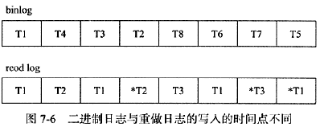
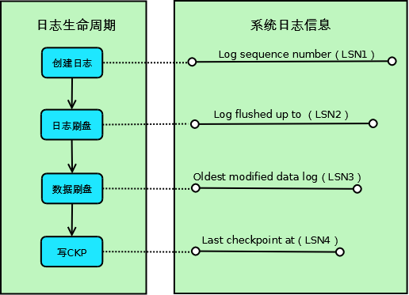
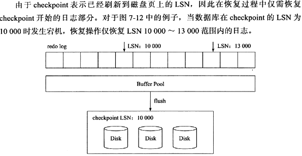
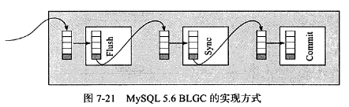
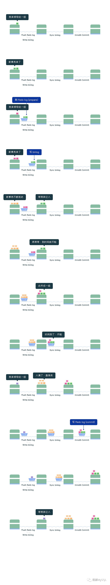

>原子性
>
>一致性
>
>隔离性
>
>持久性
#7.1 认识事务
虽然事务的定义极其严格：ACID，但是不同的数据库厂商出于各种目的，并没有去严格的遵守ACID。

#7.2 事务的实现
MySQL中对于ACID的实现：

隔离性：通过锁实现。

原子性、持久性：redo。

一致性：undo log。

> Redo Log：恢复某个已提交事务修改的页操作；物理日志：记录页的修改情况
>
>Undo Log：回滚某一行数据到某个特定版本。逻辑日志：保存行的旧版本
##Redo Log
redo log基本上都是顺序写，数据库运行时不需要对redo log进行读取操作。而undo log则会进行随机读写。

innodb_flush_log_at_trx_commit： 
1：事务提交时，把重做日志缓冲写入到重做日志文件，并调用一次fsync操作； 
0：提交时不写重做日志文件，由master thread定期去做。 
2：事务提交时，把重做日志写入重做日志文件，但不执行fsync。 

设置为0和2会提高性能，但是会丧失持久性。

|XXX|Binlog|Redolog|
|---|---|---|
|写入时机|事务执行过程中，binlog event不断写入binlog_cache， 事务提交时，把cache写入文件|事务执行过程中不断写入redolog buffer，提交时写入到文件|

define LOG_BLOCK_CHECKPOINT_NO 8 /* 4 lower bytes of the value of

###LSN:
重做日志写入的总量：可以理解为系统的逻辑时钟。

checkpoint的位置: 在第一个redo log文件头部进行记录。

页的版本--FIL_PAGE_LSN，page_header有以上结构，更改页的记录时的lsn。

创建阶段：事务创建一条日志；

日志刷盘：日志写入到磁盘上的日志文件；

数据刷盘：日志对应的脏页数据写入到磁盘上的数据文件；

写CKP：日志被当作Checkpoint写入日志文件；

对应这4个阶段，系统记录了4个日志相关的信息，用于其它各种处理使用：

Log sequence number（LSN1）：当前系统LSN最大值，新的事务日志LSN将在此基础上生成（LSN1+新日志的大小）；

Log flushed up to（LSN2）：当前已经写入重做日志文件的LSN；

Oldest modified data log（LSN3）：当前最旧的脏页数据对应的LSN，写Checkpoint的时候直接将此LSN写入到日志文件；

Last checkpoint at（LSN4）：当前已经写入Checkpoint的LSN；

Checkpoint表示的是已经刷新到磁盘上去的LSN。

上图中“当数据库在checkpoint的LSN为10000时发生宕机”，意思是宕机的时刻redo log中记录的CKP为10000。

##7.2.2 Undo Log
实现事务回滚、MVCC的功能。

支持的最大的事务数目是128*1024。
InnoDB最新版本支持128个回滚段（rollback segment），每个回滚段有1024个undo段（undo log segment）。

##7.2.3 Purge
delete、update操作并不直接删除原有的数据。

create table t(
    a int,
    b int,
    primary key(a),
    key(b)
)engine = innodb

DELETE FROM T WHERE a = 1;

上述delete操作仅仅将聚簇索引树上主键为1的记录（record）的delete_flag标记为1，而辅助索引树上的记录没有任何处理。

真正的处理被延迟到了Purge中。

##Group Commit
详见XA-2PC&GroupCommit

开启group commit的作用就是为了把多次fsync合并成一次fsync提高性能；
> 但是InnoDB1.2之前的版本，在开启Binlog以后，会导致group commit失效（就是实际上并不会组提交fsync，还是会单个事务fsync一次）
>
> 为了保证

InnoDB引擎提交事务的两个阶段：
1、修改内存中的事务信息、把重做日志写入重做日志缓冲
2、调用fsync确保日志从重做日志缓冲写到磁盘
如果InnoDB引擎层面使用组提交，则1和2可以放在两个组里分别操作，通过一次fsync刷入多个事务的重做日志，提高性能。

InnoDB1.2之前的版本
但是如果MySQL开启了binlog以后，InnoDB引擎1.2之前的版本的版本会出问题，原因是为了保持binlog和redolog的一致性，MySQL采用了2pc事务，具体如下：
①当事务提交时Innodb引擎进行prepare操作
②MySQL层写入binlog
③InnoDB层写入重做日志，细分为上面的1和2
一个臭名昭著的prepare_commit_mutex，将redo log和binlog刷盘串行化，串行化的目的也仅仅是为了保证redo log-Binlog一致，但这种实现方式牺牲了性能。

InnoDB1.2之后的版本;
可以更好的兼容MySQL的Binary Log Group Commit：

###Flush
leader将每个事务的二进制日志写入内存；
###Sync:
leader将组内的binlog写入到文件并根据sync_binlog刷盘
###Commit:
leader根据顺序调用innodb的提交操作

史上最全Group Commit

> WAL机制 (Write Ahead Log)定义:
WAL指的是对数据文件进行修改前，必须将修改先记录日志。MySQL为了保证ACID中的一致性和持久性，使用了WAL。
>Redo log的作用:
Redo log就是一种WAL的应用。当数据库忽然掉电，再重新启动时，MySQL可以通过Redo log还原数据。也就是说，每次事务提交时，不用同步刷新磁盘数据文件，只需要同步刷新Redo log就足够了。相比写数据文件时的随机IO，写Redo log时的顺序IO能够提高事务提交速度。
>组提交的作用:
在没有开启binlog时
Redo log的刷盘操作将会是最终影响MySQL TPS的瓶颈所在。为了缓解这一问题，MySQL使用了组提交，将多个刷盘操作合并成一个，如果说10个事务依次排队刷盘的时间成本是10，那么将这10个事务一次性一起刷盘的时间成本则近似于1。
当开启binlog时
为了保证Redo log和binlog的数据一致性，MySQL使用了二阶段提交，由binlog作为事务的协调者。而 引入二阶段提交 使得binlog又成为了性能瓶颈，先前的Redo log 组提交 也成了摆设。为了再次缓解这一问题，MySQL增加了binlog的组提交，目的同样是将binlog的多个刷盘操作合并成一个，结合Redo log本身已经实现的 组提交，分为三个阶段(Flush 阶段、Sync 阶段、Commit 阶段)完成binlog 组提交，最大化每次刷盘的收益，弱化磁盘瓶颈，提高性能。

在MySQL中每个阶段都有一个队列，每个队列都有一把锁保护，第一个进入队列的事务会成为leader，leader领导所在队列的所有事务，全权负责整队的操作，完成后通知队内其他事务操作结束。
Flush 阶段 (图中第一个渡口)
1. 首先获取队列中的事务组
2. 将Redo log中prepare阶段的数据刷盘(图中Flush Redo log)
3. 将binlog数据写入文件，当然此时只是写入文件系统的缓冲，并不能保证数据库崩溃时binlog不丢失 (图中Write binlog)
4. Flush阶段队列的作用是提供了Redo log的组提交
5. 如果在这一步完成后数据库崩溃，由于协调者binlog中不保证有该组事务的记录，所以MySQL可能会在重启后回滚该组事务

Sync 阶段 (图中第二个渡口)
1. 这里为了增加一组事务中的事务数量，提高刷盘收益，MySQL使用两个参数控制获取队列事务组的时机：
2. binlog_group_commit_sync_delay=N：在等待N μs后，开始事务刷盘(图中Sync binlog)
3. binlog_group_commit_sync_no_delay_count=N：如果队列中的事务数达到N个，就忽视binlog_group_commit_sync_delay的设置，直接开始刷盘(图中Sync binlog)
4. Sync阶段队列的作用是支持binlog的组提交
5. 如果在这一步完成后数据库崩溃，由于协调者binlog中已经有了事务记录，MySQL会在重启后通过Flush 阶段中Redo log刷盘的数据继续进行事务的提交

Commit 阶段 (图中第三个渡口)
1. 首先获取队列中的事务组
2. 依次将Redo log中已经prepare的事务在引擎层提交(图中InnoDB Commit)
3. Commit阶段不用刷盘，如上所述，Flush阶段中的Redo log刷盘已经足够保证数据库崩溃时的数据安全了
4. Commit阶段队列的作用是承接Sync阶段的事务，完成最后的引擎提交，使得Sync可以尽早的处理下一组事务，最大化组提交的效率
