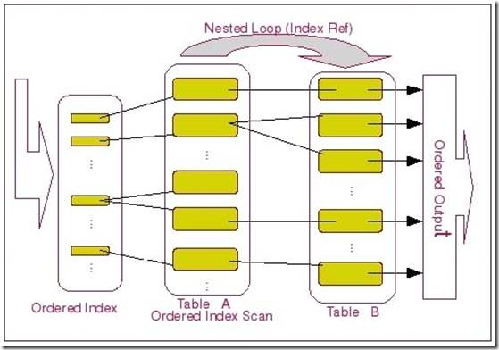
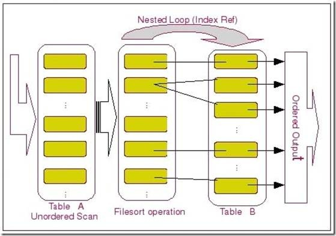
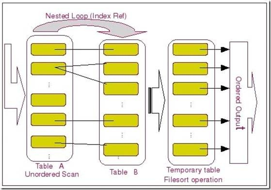
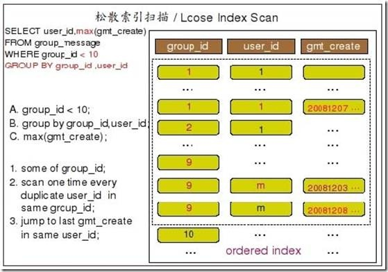
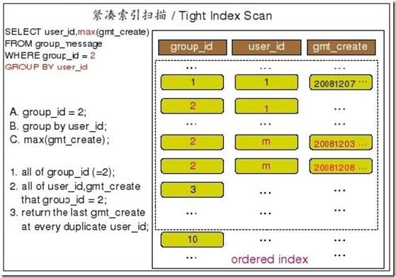
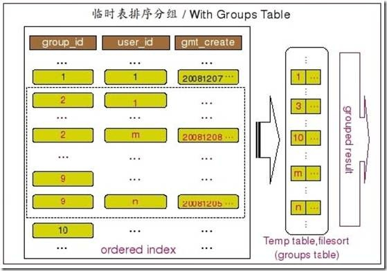

本文内容参考：
http://www.cnblogs.com/ggjucheng/archive/2012/11/18/2776449.html

>#ORDER BY
##实现方式
###1、通过有序索引而直接取得并返回的数据

上图中的 Table A 和 Table B 分别为上面 Query 中的 group_message 和 gruop_message_content
这两个表。

左边的Ordered Index指的是group_id和user_id的联合索引，Table A是group_message的聚簇索引，Table B是group_message_content的聚簇索引。
###2、无法走索引，只能通过排序算法把引擎返回的数据排序后再返回数据
示意图 

MySQL从一个表取了结果之后，又按照排序字段进行了一次filesort，也就是排序操作，然后再利用排序后的结果集作为驱动表通过Nested Loop Join访问第二个表。

当看到MySQL的explain输出using filesort不要太过紧张，这说明排序的时候没有使用索引，如果输出using temporary;using filesort则需要引起注意了，说明使了磁盘 
临时文件，效率会降低。一句话using filesort需要酌情优化。 
####（1）多次IO
取出满足过滤条件的排序字段，以及可以直接定位到行数据的行指针信息，在Sort Buffer中进行实际的排序操作，然后利用排好序之后的数据根据行指针信息返回表中取得客户端请求的其他字段的数据，再返回给客户端；

①取出满足条件的排序字段和行指针（主键），在sort buffer内对排序字段排序

②通过排序后的主键去拉取数据，然后返回
####（2）单次IO
根据过滤条件一次取出排序字段以及客户端请求的所有其他字段的数据，并将不需要排序的字段存放在一块内存区域中，然后在SortBuffer中将排序字段和行指针信息进行排序，最后再利用排序后的行指针与存放在内存区域中和其他字段一起的行指针信息进行匹配合并结果集，再按照顺序返回给客户端。

①取出符合条件的：排序字段、主键、以及客户端请求的所有字段
②在内存中排序，然后返回

上图中的排序结果集只来源于单张表的比较简单的filesort，在我们实际应用中，很多时候我们的业务要求可能并不是这样，可能需要排序的字段同时存在于两个表中，或者MySQL在经过一次Join之后才进行排序操作。这样的排序在MySQL中并不能简单的里利用Sort Buffer进行排序，而是必须先通过一个临时表将之前Join的结果集存放入临时表之后在将临时表的数据取到Sort Buffer中进行操作。

我们的排序操作只能在Join操作会后才能进行，即上图的过程。
前一个图的排序操作可以在Join之后，因为它是单个表的排序结果集。

首先是TableA和TableB进行Join，然后结果集进入临时表，再进行filesort，最后得到有序的结果集数据返回给客户端。

##总结

排序的优化方法：

1、增大max_length_for_sort_data

2、去掉不必要的字段

3、增大sort_buffer_size参数设置
>#GROUP BY
##分类
###松散型索引分组

###紧凑型索引分组

###无索引走临时表

当MySQL Query Optimizer发现仅仅通过索引扫描并不能直接得到GROUP BY的结果之后，他就不得不选择通过使用临时表然后再排序的方式来实现GROUP BY了。

##总结
>#DITINCT

