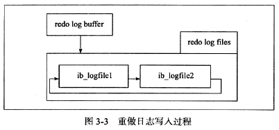

#参数文件
#日志文件
## 错误日志
## 慢查询日志
## 查询日志
记录了所有对数据库的请求信息，无论这些请求是否得到正确的执行。${主机名}.log
## 二进制日志
###恢复
某些数据的恢复需要二进制日志
###复制
主从同步
###审计
###binlog_cache_size
事务执行过程中，所有未提交（uncommitted）的二进制日志会被记录到一个缓冲中，当事务提交时（commit），缓冲中的内容被写入到二进制日志文件。该缓冲大小受binlog_cache_size控制。

binlog_cache是面向会话的。

当一个事务的记录大于设定的binlog_cache_size时，MySQL会把缓冲中的日志写入一个临时文件，事务提交时把临时文件内容写入二进制日志文件。

event0,event1,event2... ...events---->binlog_cache--（如果binlog_cache不够用，会先写到临时文件中）-->binlog

SYNC_BINLOG = [N]

这个N
是什么意思呢？是N个binlog events吗？此处有一个大大的疑问！！！！！！！！！！！！
源代码binlog.cc里：
int binlog_cache_data::write_event(THD *thd, Log_event *ev) {
  DBUG_ENTER("binlog_cache_data::write_event");
写入binlog_cache的最小单位是event
###BinLog格式
1. Statement
Statement + RC 会导致丢失更新的问题。
1. Row
Row + RC  有更好的性能。
1. Mixed
#InnoDB存储引擎文件
## 表空间文件
默认的表空间文件是：ibdata1。

可以配置多个共享表空间文件：innodb_data_file_path=/db/ibdata1:2000M;/disk2/db/ibdata2:2000M:autoextend

可以配置每个表一个单独的表空间文件：innodb_file_per_table，单独的表空间文件${table_name}.ibd文件，只存放数据页、索引页、插入缓冲位图（insert buffer bitmap）。

## 重做日志文件

1. redo_log_type:       重做日志类型
2. space:               表空间id
3. page_no:             页的偏移量
4. redo_log_body:       重做日志条目的数据部分
ib_logfile0和ib_logfile1。
写入重做日志文件的操作不是直接写，而是先写入一个重做日志缓冲（redo log buffer），然后按照一定的顺序写入重做日志文件。

###重做日志缓冲（redo log buffer）写入重做日志文件（redo log file）的条件：
####Master线程每秒把重做日志缓冲写入重做日志文件，不论事务是否提交
####innodb_flush_log_at_trx_commit（在commit提交时，处理重做日志的方式）：
> 0:当事务提交时，并不写重做日志文件，而是等待Master Thread；

> 1:当执行commit时，把重做日志缓冲同步到磁盘，并且有fsync的调用；

> 2:当执行commit时，把重做日志缓冲异步写到磁盘，即没有fsync调用，只是写入了OS的缓冲；

