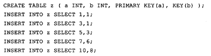
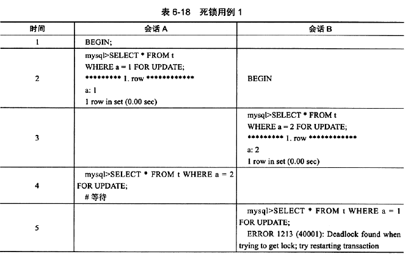

#6.3 InnoDB存储引擎中的锁
##6.3.1 锁的类型
###表锁 Table Lock
1. IS:  意向S锁
1. IX:  意向X锁
1. S:   表级S锁
1. X:   表级X锁
###记录锁 Record Lock(Row Lock)
1. S:   行级S锁
2. X:   行级X锁

> 行级的S、X锁在获取之前会首先被赋予IS、IX锁

> 表级的S、X锁在获取之前并不会活获取IS、IX锁

意向锁的作用（考虑需要给某表添加一个表级X锁的场景）：
1. 如果没有意向锁，需要判断整个锁相关的内存，判断某张表是否被X锁锁住。
1. 有了意向锁，如果表上有IX所或者IS锁，说明表中的某字段在被S、X锁锁住，表的X锁暂时不能获取到。省时省力！！！

##6.3.2 一致性非锁定读
InnoDB默认的读取方式，不会占用和等待锁。

不同的事务隔离级别，读取方式不同。

并不是每个事务隔离级别都会采用一致性非锁定读。

即使是都采用一致性非锁定读的两个隔离级别，对数据快照的定义也不相同。

> Read Committed:总读取被锁定行的最新一个快照

> Repeatable Read:读取被锁定行事务开始时的快照

##6.3.3 一致性锁定读
除了默认的一致性非锁定读以外，有些场景下，用户需要显示地对读取操作加锁，以保证数据逻辑一致性。

数据库需要支持加锁语句，即使是针对SELECT语句：

InnoDB的两种一致性锁定读：

> SELECT ... FOR UPDATE;对读取的记录加X锁
> 
> SELECT ... LOCK IN SHARE MODE;对读取的记录加S锁

即使读取的行通过以上两种锁锁定，在一致性非锁定读下，还是可以立即读到数据。

##6.3.5 外键与锁
create table s_user(
    u_id int auto_increment primary key,
    u_name varchar(15),
    u_pwd varchar(15),
    u_truename varchar(20),
    u_role varchar(6),
    u_email varchar(30)
);
insert into s_user values
      (1,"wangc","aaaaaa","wangchao","buyer","wang@163.com"),
      (2,"huangfp","bbbbbb","huangfp","seller","huang@126.com"),
      (3,"zhang3","cccccc","zhangsan","buyer","zhang@163.com"),
      (4,"li4","dddddd","lisi","seller","li@1256.com");

create table s_orderform(
    o_id int auto_increment primary key,
    o_buyer_id int,
    o_seller_id int,
    o_totalprices double,
    o_state varchar(50),
    o_information varchar(200),
    foreign key(o_buyer_id) references s_user(u_id),      #外链到s_user表的u_id字段
    foreign key(o_seller_id) references s_user(u_id)      #外链到s_user表的u_id字段
);

建立外键后,有什么影响呢?

>如果所指向的s_user 的u_id不存在时, 在insert从表时是不成功的
>
>主表增加记录是不受从表影响
>
>当主表对应的实体数据发生改变时,从表该怎么处理?
>
> 主表删除 on delete
1. casecade 关联操作,主表删除或者删除时,那么从表也会执行相应的操作(主表删除,从表也删出,由于数据不可逆,慎用)
1. set null 设置为null,表示从表不指向任何主表记录(经常用,数据也安全)
1. restrict ,拒绝主表的相关操作

对外键值的插入和更新，首先去查询主表，既SELECT主表。对于主表的SELECT操作采用的是SELECT ... LOCK IN SHARE MODE(行加S锁)，

而不是一致性非锁定读，为了防止一致性出错。如果这时候主表对应行已经有了X锁，那么子表的操作会被阻塞。

#6.4 锁的算法
##6.4.1 行锁的三种算法
>Record Lock:单个行记录的锁
> 
>record lock总是去锁索引，如果没有任何索引，则会去通过隐式主键来锁定。
>
>Gap Lock:锁定一个范围，但不包括记录本身,Gap锁的目的是防止多个事务把数据插入到同一个范围，引起幻读问题。
>

在可能插入辅助索引b = 3的地方都给锁住！！！

>Next-Key Lock:Gap Lock + Record Lock，锁定一个范围，并且锁定记录本身
>
>在查询的索引包含唯一索引时，Next-Key Locking会降级为Record Lock!!!降级仅发生在查询的列是唯一索引的情况！！！

##6.4.2 解决Phantom问题
一致性非锁定读的多版本并发控制的目的是提高读的并发量，读不会被S、X锁阻塞；

Next-Key Locking技术的目的是解决了幻读问题。

Repeatable Read级别下：默认使用Next-Key Locking技术；

Read Commited级别下：默认是用Record Lock；

使用Next-key Locking技术实现业务层面的唯一性检查：
create table z (a int, b int, primary key (a), key (b))engine = innodb;

SELECT * FROM TABLE WHERE COL = XXX LOCK IN SHARE MODE;
if none result
    insert into ... values
    
#6.5 锁问题
##6.5.1 脏读
脏页：对缓冲池的数据页做过修改，但还未同步到磁盘；

脏数据：对行数据做出修改，事务还未提交；一个事务读到另外一个事务的脏数据，这违背了数据库的隔离性。
##6.5.2 不可重复读
一个事内的两次读，读到其他事务提交过的数据，导致两次数据不一致。

#6.6 阻塞
一个事务中的锁需要等待另一个事务中的锁释放其占用的资源。

innodb_lock_wait_timeout：控制等待锁的时间；面向Seesion和Global，可动态修改。

> 可以根据这个特性实现以下功能：判断需要处理的数据是否有锁，有锁立即返回错误，无锁才进行操作。

手工开启事务，一定要commit或者rollback，不然会导致数据不一致。

#6.7 死锁
##6.7.1 概念
两个或者两个以上的事务在执行过程中，因争夺锁资源而造成的一种互相等待的现象。

处理死锁的两种方案：

1、innodb_lock_wait_time：超时回滚

2、wait-for-graph：根据是否有回路判断是否有死锁

发现死锁后，InnoDB会回滚其中一个事务。
##6.7.2 死锁的概率？？pass
##6.7.3 死锁的示例

InnoDB自动在外键上建立一个索引。

#6.8锁升级
InnoDB不存在锁升级，因为它使用位图管理锁。每一个页中的记录用位图记录其是否被锁。

